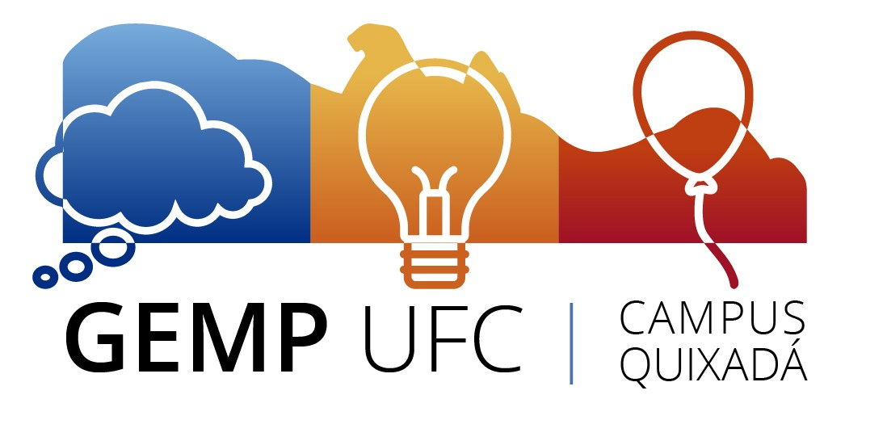

## Grupo de Estudos para a Maratona de Programação (GEMP)

A Maratona de Programação é uns das competições científicas organizadas pela Sociedade Brasileira de Computação (SBC) de competição de programação, que existe desde de 1996. O evento faz parte da International Collegiate Programming Contest (ICPC). 

A competição busca promover a criatividade, o trabalho em equipe e a habilidade de resolver problemas computacionais com restrição de tempo de execucão e/ou memória.

O Grupo de Estudos para a Maratona de Programação (GEMP) é um grupo que tem como objetivo reunir e preparar os alunos para a participação de várias competições de programação. O GEMP atua no Campus de Quixadá desde 2009. 

Os objetivos do GEMP são:
* Disseminar a prática da boa programação e também o estudo de problemas computacionais
de difícil tratamento.
* Desenvolver as habilidades de programação e matemáticas através de desafios.
* Familiarizar os alunos com as ferramentas e técnicas para solução de problemas.
* Promover a excelência dos alunos e a integração através de competição salutar..
* Introduzir os estudantes que irão compor o grupo, aos problemas de alta complexidade abordados na competição
* Tornar habitual o estudo de problemas considerados difíceis pela comunidade acadêmica da computação e divulgar estes através do grupo de estudos que será criado pelos bolsistas;
* Promover uma atividade complementar extra-curricular com o intuito de dar uma maior dinamicidade ao curso.

* Desenvolver a capacidade de trabalho em cooperação com corpo docente e discente.

## Resultados alcançados: 
* Três alunos selecionados para a fase nacional da OBI 2017.
* Três alunos selecionados para a terceira fase da OBI 2018.* •Quatros alunos selecionados para a terceira fase da OBI 2019.
* Classificação para a Fase Final do Collegiate Cup Brasil 2017.
* Classificação para a fase Nacional da Maratona de Programação em 2018, 2019, 2020, 2021, 2022.
* Classificação para a final mundial do ICPC em 2020.
* Medalha de bronze na Fase Nacional da Maratona de Programação 2019.
* Melhor artigo dos Encontros Universitários 2019 do Campus de Quixadá na trilha de Bolsa
de apoio a Projeto de Graduação.
* 10° lugar na competição Red de Programacion Competitiva 2019.
* 8° lugar na Maratona Mineira de Programação 2019.
 
